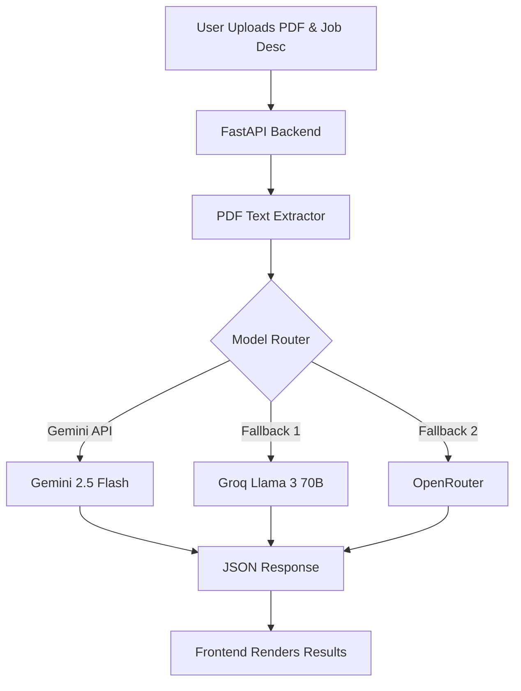

# Architecture Overview

The AI Resume Screener consists of a React/Vite frontend and a FastAPI backend, utilizing a multi-model approach for high reliability and speed.

## System Components

1. **Frontend**: React SPA using TailwindCSS for styling. Drag-and-drop file uploads, circular progress meters, and accordion components for AI feedback.
2. **Backend API**: FastAPI handling concurrent uploads.
3. **Multi-Model Router**:
   - `Gemini 2.5 Flash`: Primary model used for deep parsing of large resumes (high context window).
   - `Groq (Llama 3 70B)`: Fallback model used if Gemini hits rate limits. Lightning fast.
   - `OpenRouter`: Secondary fallback.

## Workflow

