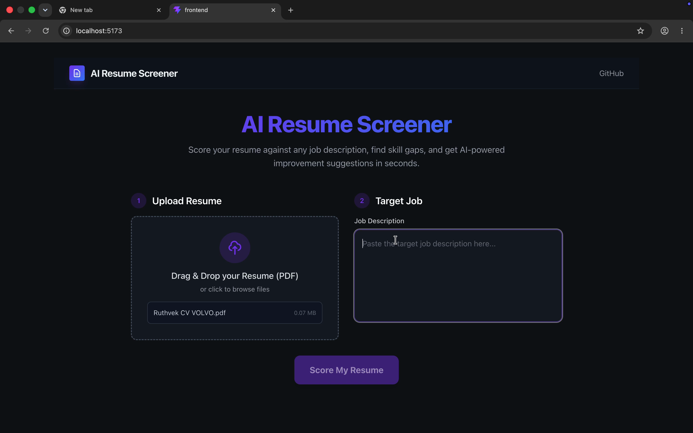
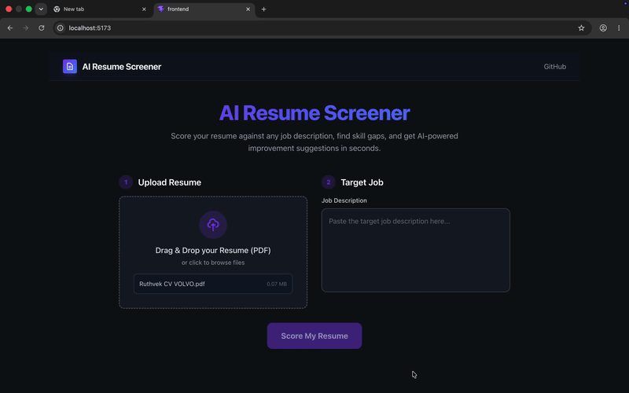

# 🚀 AI Resume Screener & Job Match Scorer


Upload your resume PDF and any job description. The AI scores your fit (0–100), finds skill gaps, and rewrites your bullet points using a multi-model approach (Gemini 2.5 Flash + Groq Llama 70B).

<div align="center">
  
  <br />
  
</div>

## Features

- **Long-context parsing**: Uses Gemini 2.5 Flash to handle massive PDFs accurately.
- **Smart Model Routing**: Falls back to Groq (Llama 70B) and OpenRouter if API limits are hit.
- **ATS Keyword Analysis**: Finds missing critical keywords that ATS systems look for.
- **AI Improvement Suggestions**: Generates better variations of your resume bullet points.
- **Skill Gap Chart**: Instantly compares what you have vs what the job requires.

## Quickstart

1. **Clone the repo**
   ```bash
   git clone https://github.com/yourusername/ai-resume-screener.git
   cd ai-resume-screener
   ```

2. **Backend Setup**
   ```bash
   cd backend
   python -m venv venv
   source venv/bin/activate
   pip install -r requirements.txt
   cp .env.example .env # Add your API keys here
   uvicorn main:app --reload
   ```

3. **Frontend Setup**
   ```bash
   cd frontend
   npm install
   npm run dev
   ```

## Deployment

**Backend**: Deploy to Railway by connecting your GitHub repo. Set `GEMINI_API_KEY`, `GROQ_API_KEY`, and `OPENROUTER_API_KEY` in Railway variables.
**Frontend**: Deploy to Vercel. Set `VITE_API_URL` to your Railway backend URL.

To embed on a personal site:
```html
<iframe
  src="https://your-resume-screener.vercel.app"
  width="100%"
  height="800px"
  style="border: none; border-radius: 12px;"
  title="AI Resume Screener"
/>
```

## Architecture

See [ARCHITECTURE.md](./ARCHITECTURE.md) for full details on the multi-model pipeline.

## Contributing

Pull requests are welcome. For major changes, please open an issue first to discuss what you would like to change.

## License

MIT


